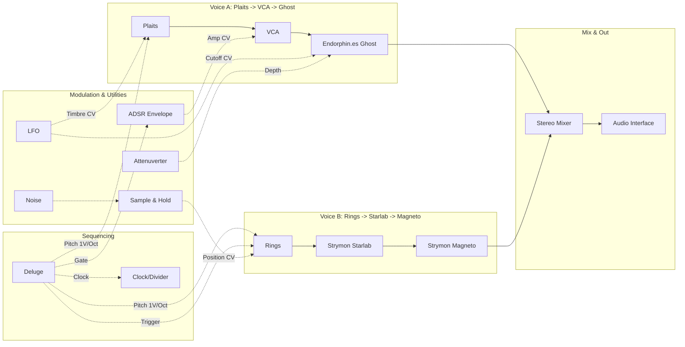

Documentation for various Eurorack Patches.

An example patch:

```mermaid
graph LR
  %% ========= Groups =========
  subgraph SEQ [Sequencing]
    DEL[Deluge]
    CLK[Clock/Divider]
  end

  subgraph VA [Voice A: Plaits -> VCA -> Ghost]
    PLAITS[Plaits]
    VCA1[VCA]
    GHOST[Endorphin.es Ghost]
  end

  subgraph VB [Voice B: Rings -> Starlab -> Magneto]
    RINGS[Rings]
    STARLAB[Strymon Starlab]
    MAGNETO[Strymon Magneto]
  end

  subgraph MOD [Modulation & Utilities]
    ADSR[ADSR Envelope]
    LFO[LFO]
    SH[Sample & Hold]
    NOISE[Noise]
    ATN[Attenuverter]
  end

  subgraph MIX [Mix & Out]
    MIXER[Stereo Mixer]
    OUT[Audio Interface]
  end

  %% ========= Audio paths (solid) =========
  PLAITS --> VCA1 --> GHOST --> MIXER
  RINGS --> STARLAB --> MAGNETO --> MIXER
  MIXER --> OUT

  %% ========= CV/Gate/Pitch (dotted) =========
  DEL -. Clock .-> CLK
  DEL -. Pitch 1V/Oct .-> PLAITS
  DEL -. Gate .-> ADSR
  DEL -. Pitch 1V/Oct .-> RINGS
  DEL -. Trigger .-> RINGS

  ADSR -. Amp CV .-> VCA1
  LFO -. Timbre CV .-> PLAITS
  LFO -. Cutoff CV .-> GHOST
  NOISE -.-> SH
  SH -. Position CV .-> RINGS
  ATN -. Depth .-> GHOST

```